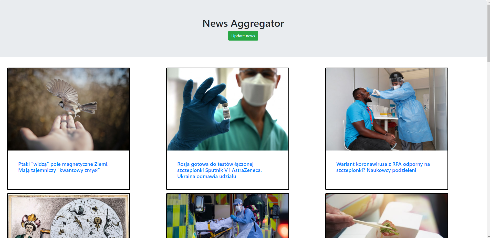

# Content aggregator
> This application enables to collect content from another websites and store them in one place.

## Table of contents
* [General info](#general-info)
* [Screenshots](#screenshots)
* [Technologies](#technologies)
* [Setup](#setup)
* [Features](#features)
* [Status](#status)
* [Contact](#contact)

## General info
Application made for excercise in aggregating content from websites, collecting them in database and extract in another website using Django framework. Currently it collects only news from focusnauka.pl website.

## Screenshots

## Technologies
* Python 3.8.1
* Django 3.1.5
* BeautifulSoup 4.9.3
* requests 2.25.1
## Setup
To install and run app you will need to:
* clone this repository to your computer or unpack .7z file in chosen directory
* run IDE or command line
* command in IDE to install demanded packages:
> pip install -r requirements.txt
* run comand line
* type "cd YOUR_DIRECTORY\aggregator" in command line
* type "python manage.py runserver 8000" in command line
* type "http://127.0.0.1:8000/" in your webbrowser.

## Features
List of features ready:
* Gaining news from focusnauka.pl website,
* Displaying news in one website.

TODOs for future development:
* Applying another websites to scrap,
* Ugrading html template.
## Status
For further development.

## Contact
Created by [@matedawid](https://linkedin.com/in/matedawid) - if you have any questions, just contact me!